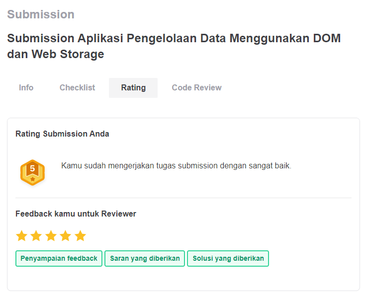

# Submission "Belajar Membuat Front-End Web untuk Pemula" Dicoding
Website ini bertemakan aplikasi Bookshelf yang datanya disimpan pada Localstorage browser. Berikut ini adalah tampilan website apabila dijalankan file index.html.

[update 18-10-2022]
Untuk live preview dapat mengunjungi link berikut:
[https://bookshelf-tgr.netlify.app/](https://bookshelf-tgr.netlify.app/)

## Hasil Penilaian Submission

